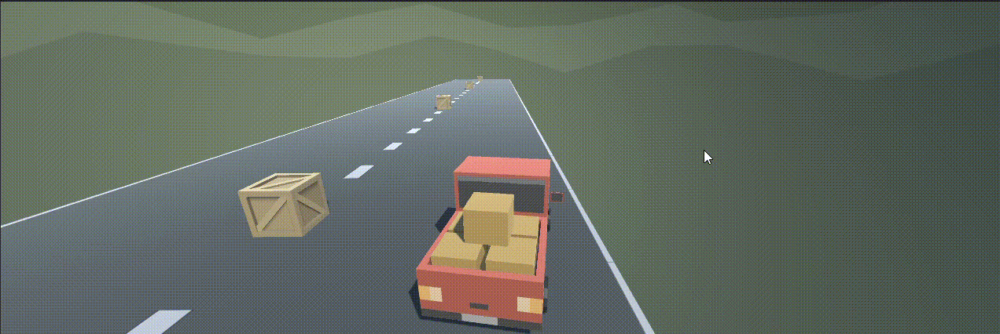

# DirectionDash
 directionDash is an exciting 3D racing game where you control a car and navigate it through a challenging course filled with obstacles. Test your reflexes and driving skills as you dash forward, backward, left, and right to avoid crashing into obstacles and aim for the highest score!

## Screenshots

## Features
- Realistic 3D graphics and immersive gameplay.
- Intuitive controls: Use arrow keys or WASD to control the car's direction.
- Dynamic obstacle course that gets progressively challenging.

## How to Play
1. Use the **up** arrow key or **W** key to accelerate and move forward.
2. Use the **down** arrow key or **S** key to reverse and move backward.
3. Use the **left** arrow key or **A** key to steer left.
4. Use the **right** arrow key or **D** key to steer right.
5. Navigate your car through the obstacles, avoiding collisions.